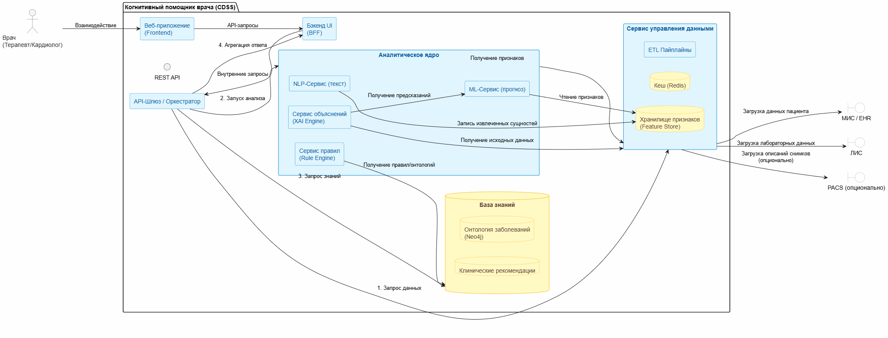
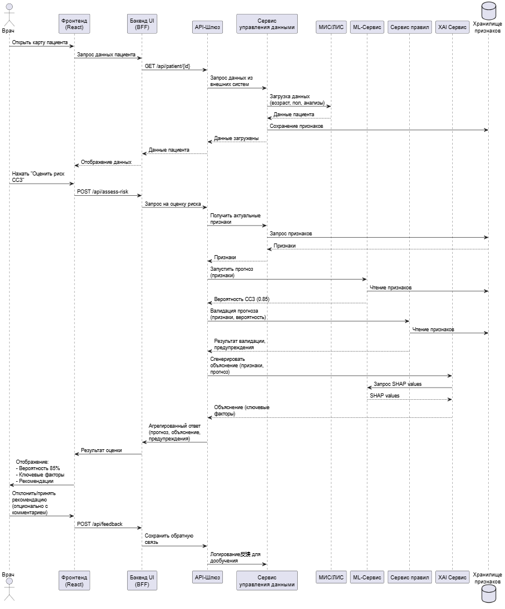
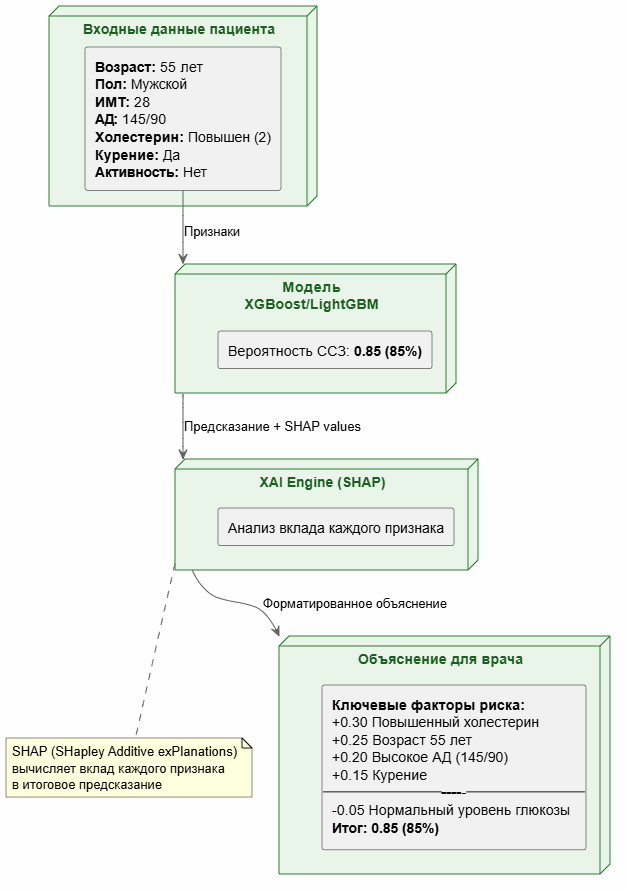

# Отчёт по практической работе №2
**Тема:** Проектирование архитектуры ИСППР для медицинского когнитивного помощника

**Выполнили:** Студенты группы МСК21

## Часть 1: Введение в инструменты и стандарты

В рамках данной работы для визуализации архитектуры был выбран инструмент **PlantUML** ввиду его доступности, бесплатности и наличия обширных компонентов. Для описания архитектуры используется нотация, близкая к **диаграммам компонентов UML** и **C4-модели** на уровне контейнеров/компонентов.

**Условные обозначения:**
- **Прямоугольник с двойной вертикальной чертой слева** — компонент (самостоятельный модуль, сервис)
- **Сплошная линия со стрелкой** — основной поток данных/запроса
- **Пунктирная линия со стрелкой** — поток управления/взаимодействия
- **Внешние сущности** — пользователи и внешние системы

## Часть 2: Разработка схемы архитектуры

### Шаг 2.1: Внешние сущности и интерфейсы (слой контекста)

На первом уровне мы определили внешние по отношению к разрабатываемой системе сущности:

- **Пользователь:** Врач-терапевт / Врач-кардиолог
- **Внешние системы-источники данных:**
  - Медицинская информационная система (МИС / EHR)
  - Лабораторная информационная система (ЛИС)
  - Система для хранения медицинских изображений (PACS) — опционально
- **Внешние потребители:** Система учёта назначений (опционально)

### Шаг 2.2: Ядро системы (контейнеры/компоненты)

В центре системы находится контейнер **"Когнитивный помощник врача (CDSS)"**, который включает следующие компоненты:

1.  **API-Шлюз / Оркестратор** — единая точка входа, управляет workflow обработки запроса.
2.  **Сервис управления данными** — отвечает за загрузку, очистку и хранение данных.
3.  **Аналитическое ядро** — включает сервисы машинного обучения, NLP, правил и объяснений.
4.  **База знаний** — хранилище онтологий и клинических рекомендаций.
5.  **Интерфейс пользователя** — веб-приложение для взаимодействия с врачом.

### Диаграмма архитектуры

На рис. 1 представлена диаграмма компонентов разрабатываемой системы.

*Рис. 1. Архитектура когнитивного помощника врача для оценки риска ССЗ*

### Диаграмма последовательности процесса оценки риска

Для детального понимания взаимодействия компонентов во времени была разработана диаграмма последовательности (рис. 2), отражающая полный цикл обработки запроса от врача до получения рекомендации.

*Рис. 2. Диаграмма последовательности процесса оценки риска ССЗ*

Диаграмма демонстрирует следующие этапы:
1. Загрузка данных пациента из внешних систем (МИС/ЛИС)
2. Сохранение признаков в Feature Store
3. Запуск ML-модели для прогнозирования риска
4. Валидация результата с помощью сервиса правил
5. Генерация объяснения через XAI Engine
6. Формирование и отображение результата врачу
7. Сбор обратной связи для дообучения модели

### Принцип работы XAI Engine

Ключевым требованием к медицинским системам является интерпретируемость результатов. На рис. 3 показан принцип работы сервиса объяснений (XAI Engine), который использует метод SHAP для определения вклада каждого признака в итоговый прогноз.

*Рис. 3. Пример работы XAI Engine (объяснение прогноза)*

XAI Engine позволяет представить результат не как "чёрный ящик", а в виде понятного врачу отчёта:
- Вероятность ССЗ с числовым значением
- Ранжированный список ключевых факторов риска с указанием их вклада
- Визуально выделенные отклонения от нормы

### Шаг 2.3: Определение технологического стека

На основе спроектированной архитектуры был подобран технологический стек для каждого компонента.

| Компонент | Технологии (стек) |
| :--- | :--- |
| **API-Шлюз / Оркестратор** | Python (FastAPI), Kong (для продакшн-развертывания) |
| **ETL Пайплайны** | Python (Pandas, NumPy), Apache Airflow (оркестрация) |
| **Кеш** | Redis |
| **Хранилище признаков** | PostgreSQL + Feast (для управления признаками) |
| **ML-Сервис** | Python, XGBoost/LightGBM (основные модели), scikit-learn (препроцессинг), MLflow (трекинг экспериментов) |
| **NLP-Сервис** | Python, spaCy (для извлечения сущностей из текстовых описаний) |
| **Сервис правил** | Python (интерпретатор правил), простые JSON-файлы для хранения правил |
| **Сервис объяснений (XAI)** | Python, SHAP (для объяснения вклада признаков) |
| **База знаний (Онтология)** | Neo4j (графовая база данных для связей симптом-диагноз-препарат) |
| **База знаний (Рекомендации)** | Elasticsearch (индексирование и поиск по клиническим рекомендациям) |
| **Бэкенд UI (BFF)** | Python (FastAPI) |
| **Фронтенд** | React + TypeScript, Ant Design (UI-кит), Chart.js / D3.js (визуализация) |
| **Контейнеризация** | Docker |
| **Оркестрация** | Kubernetes (для продакшн-среды) |
| **Мониторинг** | Prometheus + Grafana (метрики), ELK Stack (логи), Evidently (мониторинг дрейфа данных) |

## Часть 3: Презентация и обсуждение архитектуры

### Соответствие разработанной архитектуры поставленным требованиям

1.  **Полнота:** Архитектура учитывает все ключевые слои:
    - **Слой данных:** ETL-пайплайны, кеш, хранилище признаков.
    - **Аналитическое ядро:** ML-сервис, NLP-сервис, сервис правил.
    - **Слой знаний:** База знаний с онтологией и рекомендациями.
    - **Интерфейс:** BFF + фронтенд для врача.
    - **Интеграция:** API-шлюз для связи с внешними системами (МИС, ЛИС).

2.  **Логичность связей (подтверждается диаграммой последовательности на рис. 2):**
    - Поток данных начинается с запроса от врача через UI.
    - API-шлюз координирует получение данных из внешних систем через Data Service.
    - Признаки из Feature Store подаются в ML-сервис для прогноза.
    - Результат прогноза передается в XAI Engine для генерации объяснения.
    - При необходимости Rule Engine валидирует результат на основе базы знаний.
    - Агрегированный ответ возвращается врачу через BFF и фронтенд.

3.  **Интерпретируемость (реализована через XAI Engine, рис. 3):**
    - Использование SHAP позволяет quantify вклад каждого признака.
    - Врач видит не просто вероятность, а структурированное объяснение.
    - Это повышает доверие к системе и соответствует медицинским требованиям.

4.  **Практичность стека:**
    - Выбранный стек соответствует современным требованиям разработки.
    - XGBoost/LightGBM выбраны как наиболее эффективные для данной задачи.
    - FastAPI обеспечивает высокую производительность и простоту разработки.
    - Redis и Feature Store решают проблему производительности при повторных запросах.

5.  **Учёт специфики медицины:**
    - **NLP-сервис** позволяет работать с неструктурированными текстами (жалобы, анамнез, описания рентгенограмм).
    - **Rule Engine и База знаний** обеспечивают возможность добавления экспертных медицинских знаний.
    - **XAI Engine** гарантирует интерпретируемость результатов, что критически важно для врачей.

6.  **Клиентоцентричность:**
    - Интерфейс в виде веб-приложения или виджета, встраиваемого в МИС.
    - Результат представлен не просто числом, а структурированным отчетом с выделением ключевых факторов риска.
    - Возможность отклонения рекомендации с указанием причины (сбор обратной связи).

---
### Домашнее задание (подготовка к Практике 3)

**1. Ключевые признаки для ML-сервиса (10-15 признаков)**

| № | Название признака | Тип | Описание |
|:--:|:---|:---:|:---|
| 1 | `age_years` | float | Возраст в годах |
| 2 | `gender` | int | Пол (0 - жен, 1 - муж) |
| 3 | `height` | int | Рост (см) |
| 4 | `weight` | float | Вес (кг) |
| 5 | `ap_hi` | int | Систолическое АД |
| 6 | `ap_lo` | int | Диастолическое АД |
| 7 | `cholesterol` | int | Уровень холестерина (1,2,3) |
| 8 | `gluc` | int | Уровень глюкозы (1,2,3) |
| 9 | `smoke` | bool | Курение |
| 10 | `alco` | bool | Употребление алкоголя |
| 11 | `active` | bool | Физическая активность |
| 12 | `bmi` | float | Индекс массы тела (weight / (height/100)^2) |
| 13 | `map` | float | Среднее артериальное давление (ap_lo + (ap_hi - ap_lo)/3) |
| 14 | `pulse_pressure` | int | Пульсовое давление (ap_hi - ap_lo) |
| 15 | `age_ap_hi_interaction` | float | Взаимодействие возраста и давления (age_years * ap_hi) |

**2. Ключевые правила для Rule Engine (5-7 правил)**

1.  **Правило критической гипертензии:** 
ЕСЛИ ap_hi >= 180 ИЛИ ap_lo >= 110
ТО повысить confidence_score на 0.2 И добавить предупреждение "Критически высокое АД — пациент в зоне высокого риска"

2.  **Правило метаболического синдрома:**
ЕСЛИ bmi > 30 И cholesterol >= 2 И ap_hi >= 130
ТО повысить вероятность риска ССЗ (метаболический синдром)

3.  **Правило коррекции для молодых пациентов:**
ЕСЛИ age_years < 40 И smoke = 0 И alco = 0 И active = 1 И cholesterol = 1 И ap_hi < 130
ТО понизить вероятность риска ССЗ (низкий базовый риск)

4.  **Правило сочетания вредных привычек:**
ЕСЛИ smoke = 1 И alco = 1
ТО добавить рекомендацию "Рекомендовано консультирование по отказу от курения и употребления алкоголя"

5.  **Правило валидации входных данных:**
ЕСЛИ height < 100 ИЛИ height > 220 ИЛИ weight < 30 ИЛИ weight > 200
ТО вернуть ошибку "Некорректные антропометрические данные. Проверьте рост и вес пациента."

6.  **Правило коррекции на основе физической активности:**
ЕСЛИ active = 1 И прогноз модели > 0.7
ТО проверить признаки: если cholesterol = 1 И ap_hi < 130, то понизить прогноз (активный образ жизни может компенсировать риски)

7.  **Правило для диабетиков:**
ЕСЛИ gluc >= 2
ТО повысить вес признаков, связанных с сердечно-сосудистыми осложнениями при диабете